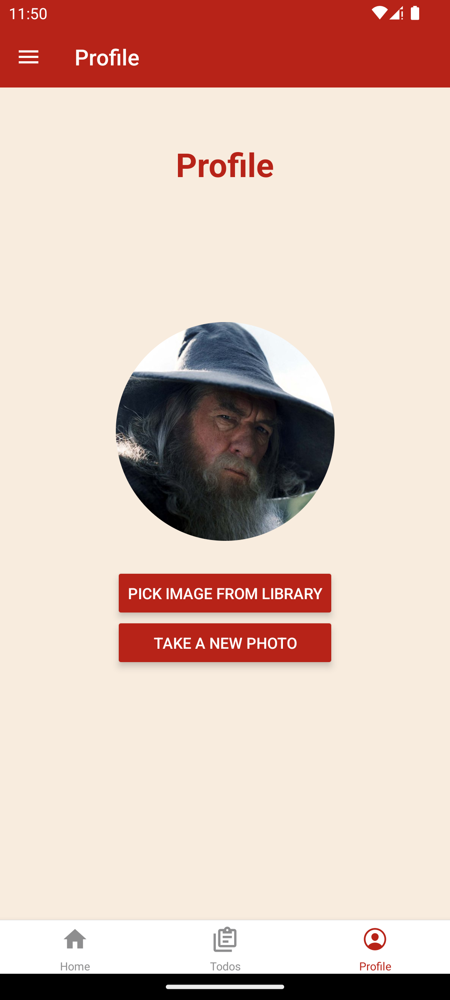

# Tasks

Follow the tasks below to complete the app. If you get stuck, you can find the solution in the respective branch in the repository. Some styles are provided in the [styles](../styles/) folder, but feel free to change them to your liking. Do not import the styles directly from the styles folder, instead copy them to the respective component and modify them there.

Some useful resources for this workshop:

- [Expo Router](https://docs.expo.dev/router/create-pages/)
- [React Native](https://reactnative.dev/docs/components-and-apis)
- [React Navigation screen options](https://reactnavigation.org/docs/screen-options/)

## Task 1 - Log in

- Update the Button text in app/index.tsx to be “Log in”
- When pressing the Login button, the app should navigate to the home page.
  Hint: navigate using the Link component or the expo router object / useRouter hook https://docs.expo.dev/router/navigating-pages/
- When logged in, it should not be possible to go back to the login page by going back in the navigation stack. Instead, add a logout button to the home page.
- Bonus: Change the title on the login page to “Login” (This can be achieved in at least 2 different ways) [(react navigation docs) ](https://reactnavigation.org/docs/headers/)

The finished screens should look something like this:

  
  

## Task 2 - Tab bar layout

- There should be three tabs: “home”, “todos” and “profile”.
  - For “todos” and “profile” we later want to add multiple screens. Consider this when creating the file structure for these tabs.
  - Don’t worry about the content of the tabs yet, just have a simple text element to see that the navigation is working.
- Only the profile tab should have a visible header.
- Each tab bar button should have a suitable icon, and suitable names
- Bonus: The tab bar icons should have the “primaryRed” color when active

The finished screens should look something like this:

  
  
  

## Task 3 - Profile page drawer layout

- Make the profile page use a drawer layout.
  - https://docs.expo.dev/router/advanced/drawer/
- The drawer should contain the following items (also, see picture for illustration). These items should appear automatically without much additional configuration.
  - Profile
  - Settings (moves to a settings screen within the profile tab)
- Bonus: add a custom drawer content component which adds the following buttons:

  - About (opens a [modal screen](https://docs.expo.dev/router/advanced/modals/), tab bar should be hidden. Remember to set presentation mode to modal). Hint: the modal should be a separate screen, not a part of the tabs layout, which means that the file must be placed outside the tabs folder.
  - Log out ( navigate back to the log in screen)

  - Tips: https://reactnavigation.org/docs/drawer-navigator#providing-a-custom-drawercontent

The finished screens should look something like this:

  
  
  

## Task 4 - Display Todos

- Fetch todos by using the todoService (simulates a remote API, but uses local storage for simplicity)
- Render todos on the todos index screen. (styles are available in the Styles folder)
  - To simplify the code in the index.tsx file, Create a TodoItem component in the components folder. See the image below for an example of how the component can look.
- Add functionality to the checkbox and trash buttons.
  - Checkbox should toggle the completed status of the todo.
  - Delete icon should delete the todo and remove it from the UI.
    - Bonus: Add a popup Toast message for feedback to the user
  - (The pencil icon is handled in the next task)

The finished todo screen should look something like this:

  

## Task 5 - Create and edit Todos

- Create two new screens, one for creating a new todo, and one for editing an existing todo.
  - We want to use dynamic routes for the editing page https://docs.expo.dev/router/create-pages/#dynamic-routes
- Add an absolutely positioned + icon to the todo page that opens the create todo screen.
- Create a TodoForm component that can be used by both the create todo and edit todo screens.
- The pencil icon on the todo item should open the edit todo screen with the content of the TodoForm already filled.
- Use the todoService to store the created and edited todos.
- Bonus: Add a popup Toast message for feedback to the user
- Extra bonus: Add a share button in the "Edit Todo"-screen that opens the share dialog on the device. [React Native share docs](https://reactnative.dev/docs/share)

The finished screens should look something like this:

  
  
  

## Task 6 - Profile screen

- Colors:
  - Set the drawer menu active tint color to Primary red.
  - Set the default background color to Primary cream white for the screens in the drawer layout.
    - Hint: Scene Container styles
  - Set the header color to Primary red and the text color to white.
    - Hint: Headerstyle and tint properties
- Profile image
  - Make it possible to select a profile image from phone library or take a new picture.
    - https://reactnative.dev/docs/image#examples
    - https://docs.expo.dev/versions/latest/sdk/imagepicker/#usage
  - For simplicity we only store the image in react state, no persisting of data.
  - Use the placeholder image, assets/images/blank-profile-picture.png , if no picture is set.

The finished screen should look something like this:

  
  

## Task 7 - Settings screen

- Use native components to add a switch and a popup modal to the settings page.
  - https://reactnative.dev/docs/modal
  - https://reactnative.dev/docs/switch
- A button should open the modal
- The switch should control the animation type of the modal
  - Choose suitable colors for the switch

The finished screen should look something like this:

  
  

## Task 8 - Animations and scrolling

- Make the todolists scrollable using ScrollView or FlatList
  - https://reactnative.dev/docs/scrollview
- Animate the todoItems when they are entering and leaving the screen.
  - https://docs.swmansion.com/react-native-reanimated/docs/fundamentals/your-first-animation
  - https://docs.swmansion.com/react-native-reanimated/docs/layout-animations/entering-exiting-animations
- Add a layout animation to the todoItems
- When a todo moves in to either the incomplete or the completed list when toggling the state, the list should scroll to the bottom so that we always can see the new item.

The finished screen should look something like this: (note how the items does not overflow, but instead the list is scrollable)

  

## Congratulations!

You have now completed the app. If you want to continue working on the app, you can try to do some of the following tasks:

- Add a custom splash screen, app icon and app name
- Add a loading indicator when fetching todos
- Add authentication
- Add a backend API to store todos instead of using local storage
- Deploy the app with Expo
